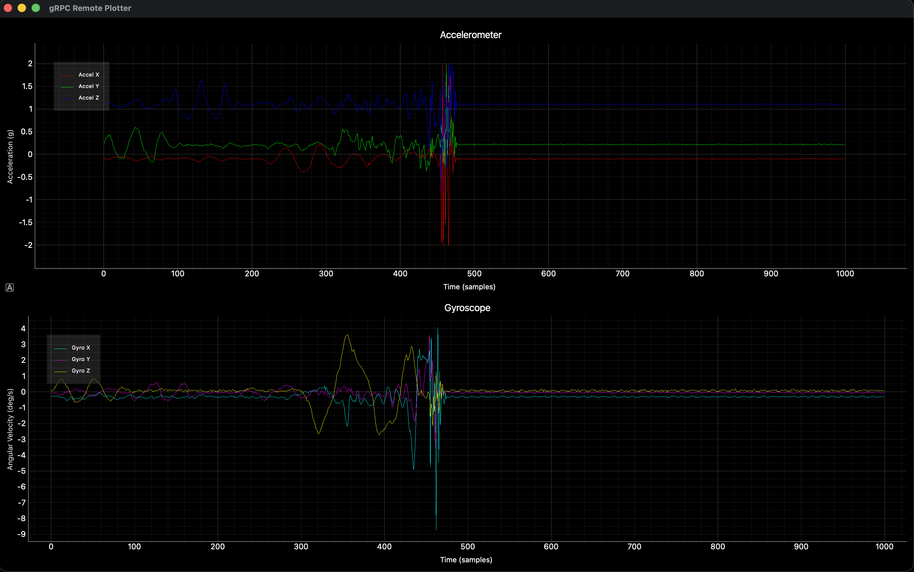

# msensor-remote-plotter

This is a gRPC Remote Plotter application where clients can configure and stream data points in real time.

It is very simple:
1. With a request you create an Axis, give it an ID.
2. With another request you create signals, give them an ID and the associated Axis ID.
3. With a stream request, you stream as many sample points as you like, simply by indicating to which signals they are associated.

Check out the [proto](./proto/plot.proto) definition file to use the API!

## Start server

`uv run python -m src.app -p 50052`

## Configuration

See example for configuring signals of an IMU sensor:

- `uv run python -m config.config_imu_signals -a localhost:50052`

--- 
# Development 

## Generate proto definitions

- `uv run python -m grpc_tools.protoc -Isrc/proto_gen=proto --python_out=. --pyi_out=. --grpc_python_out=. proto/plot.proto`

## TODO

- Error handling